[Powrót](../FEATURES.md)

# Panel administracyjny

### Użytkownicy

Administrator ma pełen podgląd użytkowników, z możliwością ich filtrowania po statusie. Wraz z opcją aktywacji i dezaktywacji konta.

|                         Desktop                         |                         Mobile                         |
|:-------------------------------------------------------:|:------------------------------------------------------:|
| 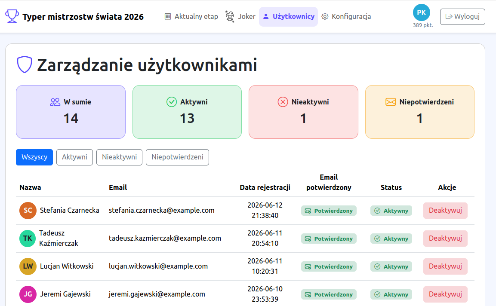  | 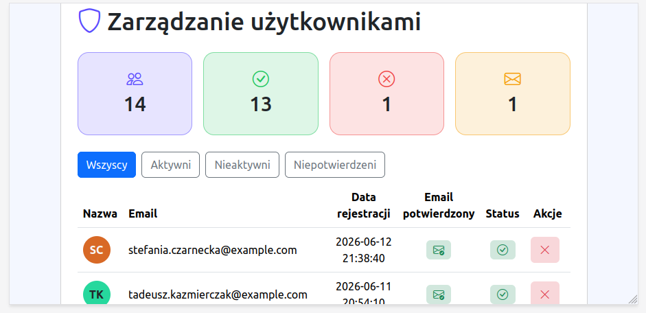  |

### Konfiguracja - Zespoły

Każdy zespół ma swoją nazwę i flagę/herb/logo.

Administrator może dodawać, edytować i usuwać zespoły.

|                         Desktop                         |                         Mobile                         |
|:-------------------------------------------------------:|:------------------------------------------------------:|
| 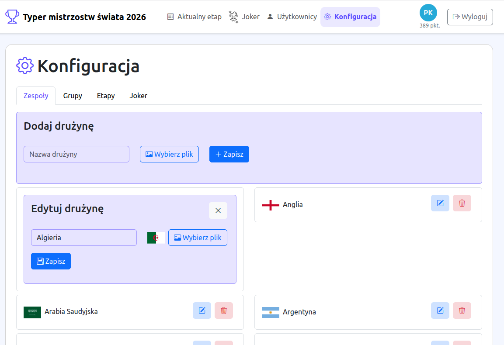  | 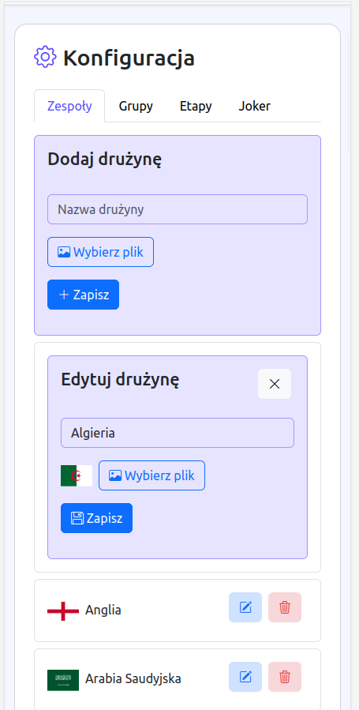  |

### Konfiguracja - Grupy

Grupa to zbiór drużyn, która przypisywana jest do etapu zawodów, aby ograniczyć ilość drużyn podczas ustawiania meczów,
jak również w celu informacyjnym podczas fazy grupowej rozgrywek.
Grupa składa się z nazwy i listy drużyn.

Do grupy dodaje się drużyny, z pomocą autocomplete, w którym wyświetlają się tylko drużyny, których jeszcze nie dodano.
Dodane drużyny od razu pojawiają się poniżej formularza. Kliknięcie flagi powoduje usunięcie jej z listy.
Wszelkie zmiany zapisywane są dopiero po kliknięciu przycisku "Zapisz".

Aby edytować grupę, wystarczy wcisnąć przycick edycji, co spowoduje, że w miejsce podglądu grupy pojawił się formularz edycji.

|                         Desktop                         |                         Mobile                         |
|:-------------------------------------------------------:|:------------------------------------------------------:|
| 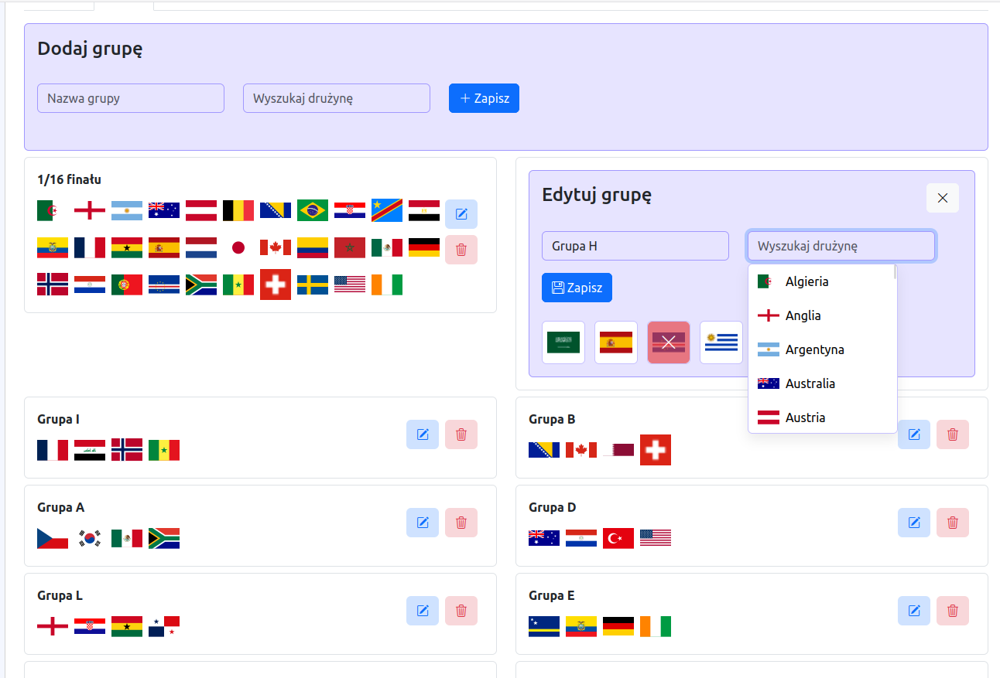 | 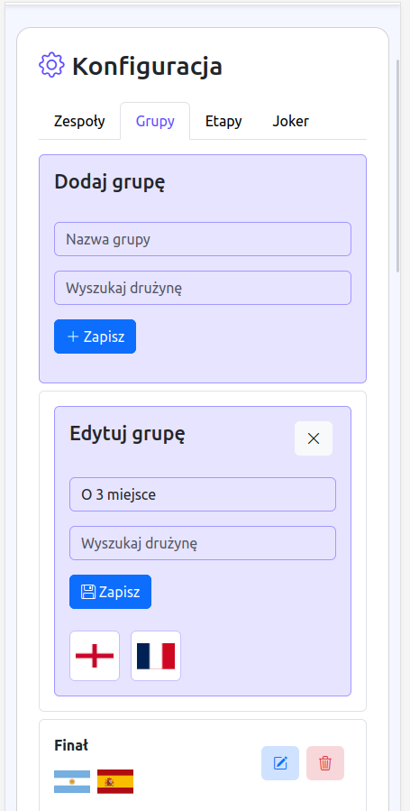 |

### Konfiguracja - Etapu

Etap to zbiór grup, który ma zbierać je w pewnym zakresie czasowym i dodawać mecze, które odbędą się w danej grupie w danym zakresie czasowym.
Etap ma nazwę, nazwę skróconą, oraz listę grup.

Do etapu dodaje się grupy z pomocą autocomplete, w którym wyświetlają się tylko niedodane jeszcze grupy. Dodane grupy od razu dodają się poniżej formularza.
Kliknięcie nazwy grupy powoduje usunięcie jej z listy. Wszelkie zmiany zapisywane są dopiero po kliknięciu przycisku "Zapisz".

Aby edytować grupę, wystarczy wcisnąć przycick edycji, co spowoduje, że w miejsce podglądu grupy pojawił się formularz edycji.

|                         Desktop                         |                         Mobile                         |
|:-------------------------------------------------------:|:------------------------------------------------------:|
| 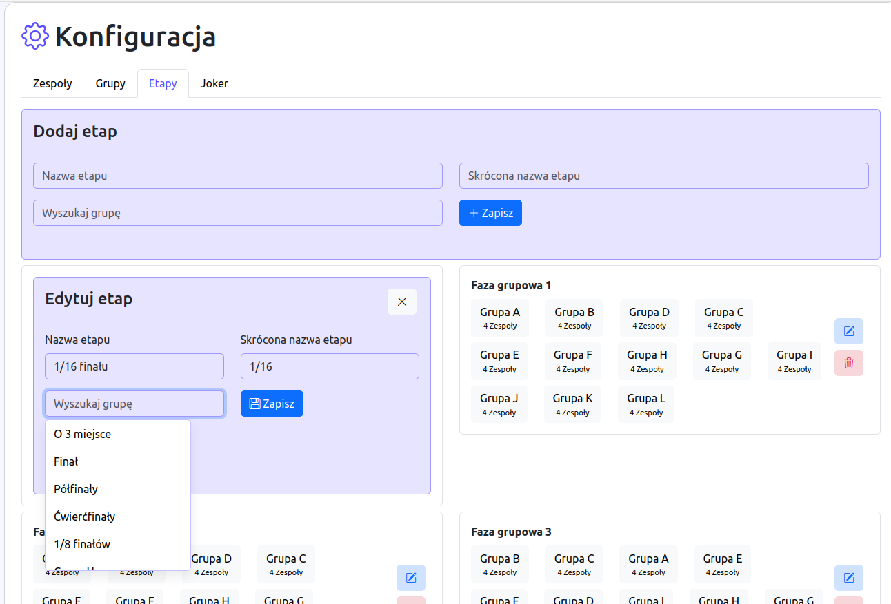 | 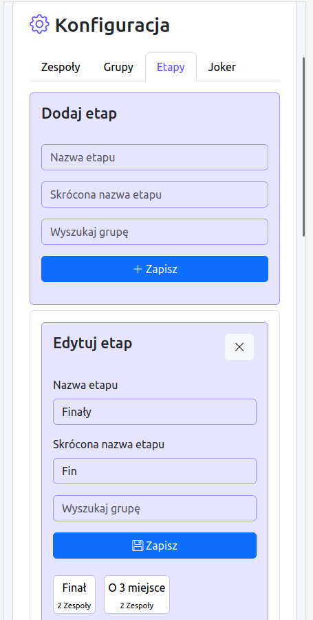 |

#### Mecze etapu

Mecze są ściśle powiązane z etapem i grupą. Wybiera się drużyny za pomocą autocomplete z listy drużyn w danej grupie, bez wybranych już do meczu drużyn.
Mecze służą do obstawiania wyników przez użytkowników.

|                        Desktop                         |                        Mobile                         |
|:------------------------------------------------------:|:-----------------------------------------------------:|
| 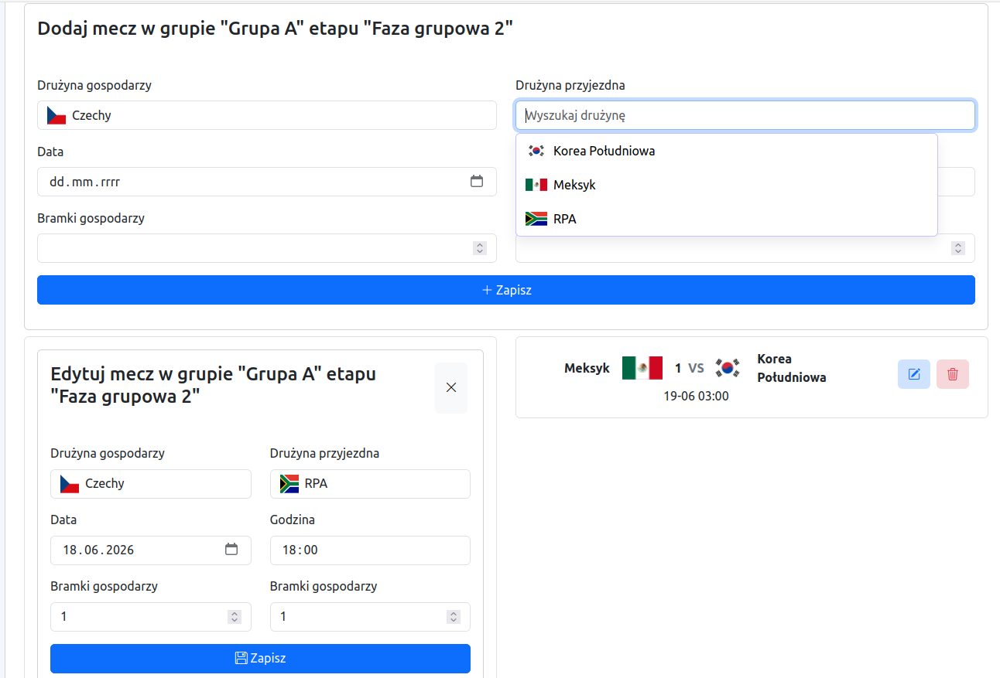 | 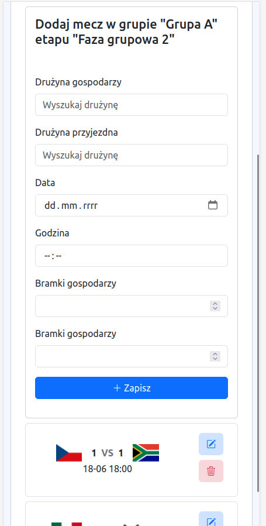 |

### Konfiguracja - Joker

Obstawienie zwycięzcy całych rozgrywek może spowodować dodaniem dodatkowych punktów. Dlatego, gdy już zwycięzca jest znany, administrator zaznacza jokera.

|                        Desktop                         |                        Mobile                         |
|:------------------------------------------------------:|:-----------------------------------------------------:|
| 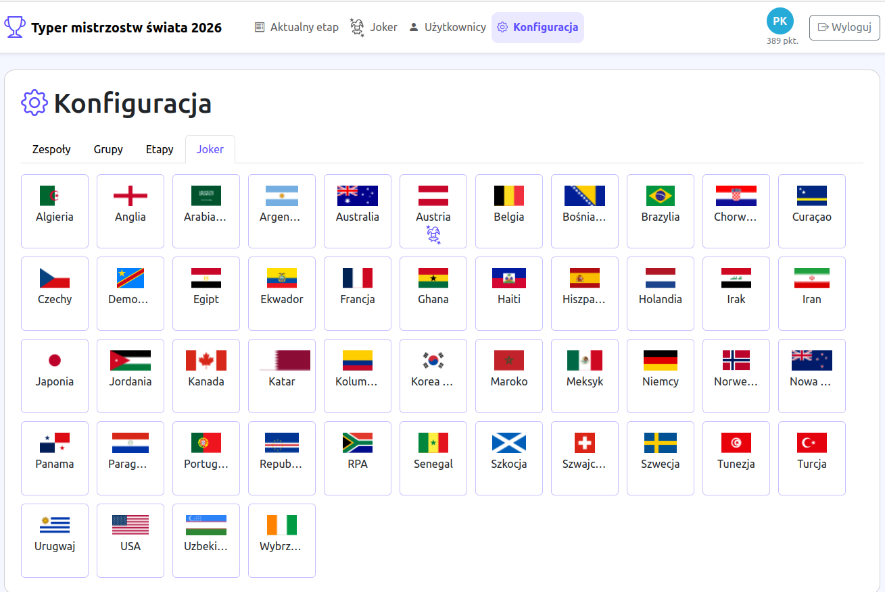 | 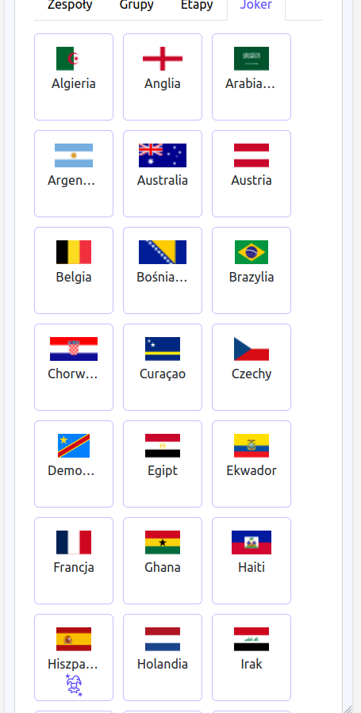 |
