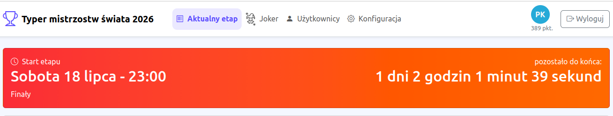
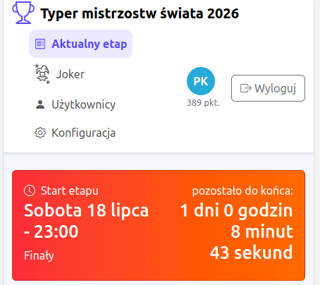
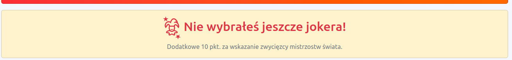
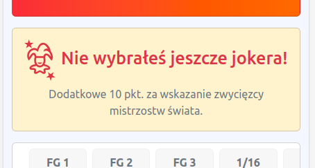
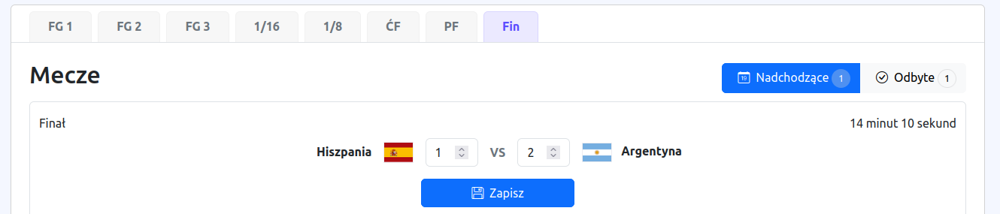
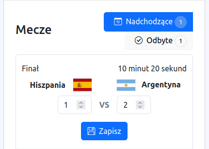
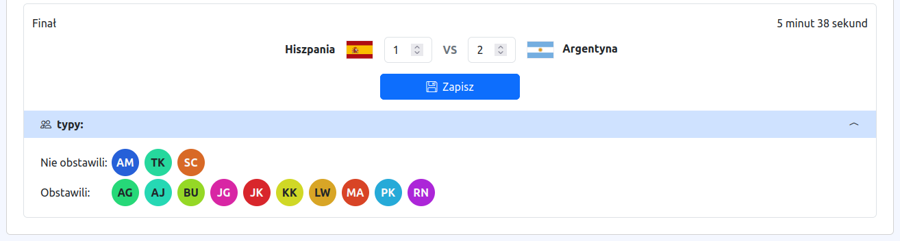
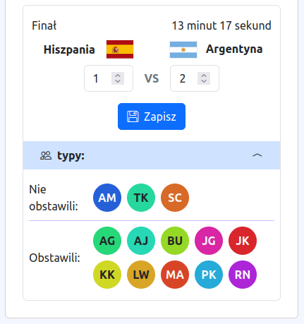
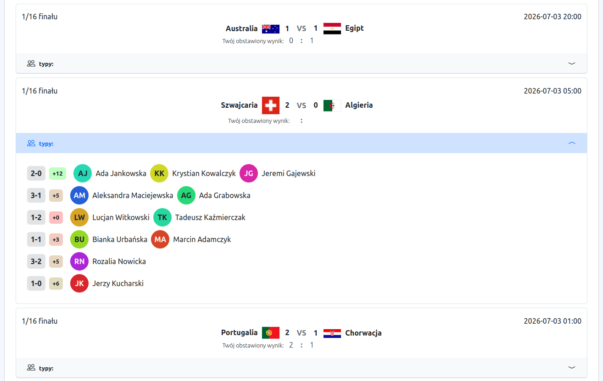
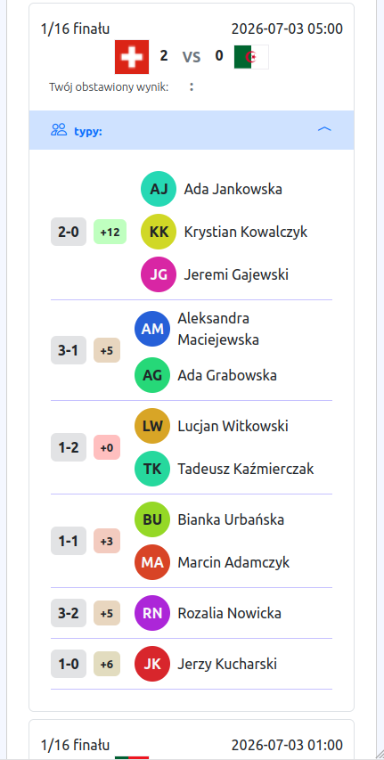

[Powrót](../FEATURES.md)

# Obstawianie

Po wejściu w zakładkę "Aktualny etap" otwierany jest aktualny lub ostatni etap.

## Timer

Na górze strony znajduje się boks z informacją:
- kiedy zaczyna się dany etap
- jak się nazywa dany etap
- ile pozostało czasu do startu danego etapu (do zakończenia możliwości obstawiania)
- lub ile pozostało do zakończenia danego etapu

|                         Desktop                          |                         Mobile                          |
|:--------------------------------------------------------:|:-------------------------------------------------------:|
|  |  |

## Przypomnienie o jokerze

Jeśli jest jeszcze możliwość obstawiania jokera i użytkownik jeszcze tego nie zrobił, to wyświetli mu się przypomnienie.

|                            Desktop                             |                            Mobile                             |
|:--------------------------------------------------------------:|:-------------------------------------------------------------:|
|  |  |

## Etapy

Aktualny etap może zawierać dwie listy meczów:

* Nadchodzące:
Mecze, które jeszcze się nie rozpoczęły i można jeszcze edytować obstawiany wynik. Lub mecze, które już się rozpoczęły, ale nie minęły jeszcze dwie godziny od ich rozpoczęcia.
* Odbyte:
Mecze, które rozpoczęły się ponad dwie godziny temu.

|                        Desktop                        |                        Mobile                         |
|:-----------------------------------------------------:|:-----------------------------------------------------:|
|   |    |

Za pomocą tabów z nazwami skróconymi etapów, można wyświetlić mecze z przeszłych i przyszłych etapów.
Jeśli etap już minął lub jeszcze się nie zaczął, to nie wyświetlany jest podział na odbyte i nadchodzące mecze.

## Podglądy meczy

#### Kto obstawił
Jeśli mecz się jeszcze nie rozpoczął, administrator może podejrzeć, kto już obstawił wynik, a kto jeszcze nie, aby mógł przypomnieć użytkownikowi o tym.

|                        Desktop                        |                        Mobile                        |
|:-----------------------------------------------------:|:----------------------------------------------------:|
|  |  |

#### Jak inni obstawiali
Gdy mecz już się rozpoczął, to jest możliwość podejrzenia jak inni obstawiali wynik.
Aby łątwiej było znaleść siebie, własne imię i nazwisko jest pogrubione i na zielonym tle.

Gdy punkty zostaną przydzielone, to dodatkowo wyświetlane są punkty dla danego wyniku, pokolorowane w zależności od ilości punktów.

|                        Desktop                         |                        Mobile                         |
|:------------------------------------------------------:|:-----------------------------------------------------:|
|    |    |