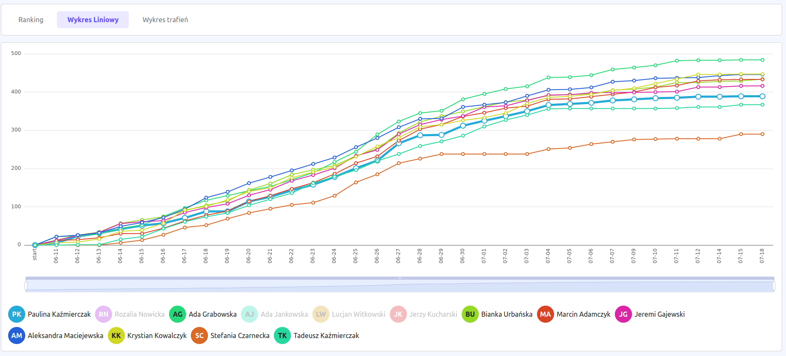
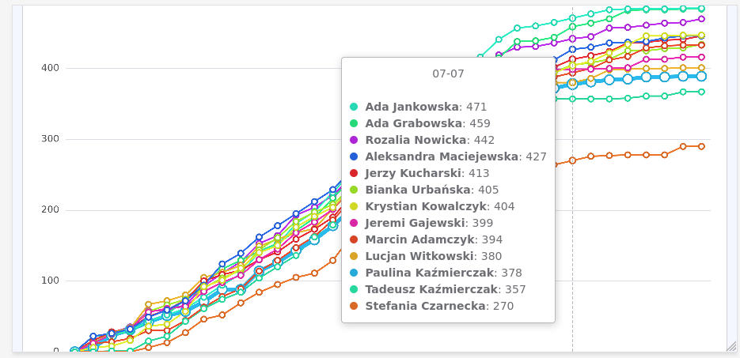
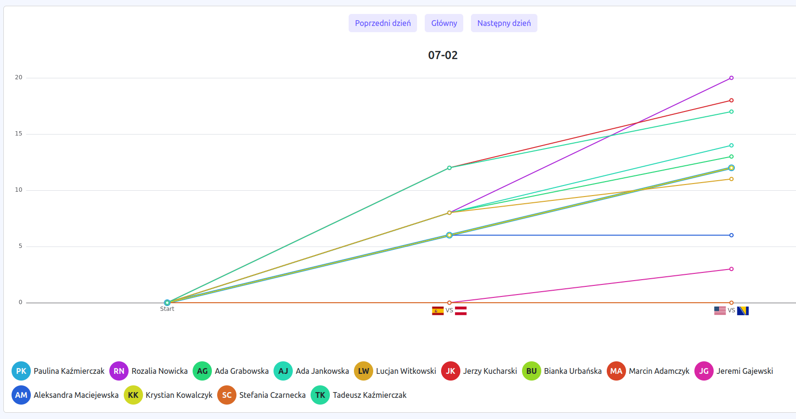
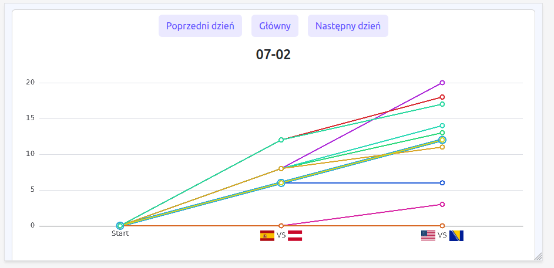
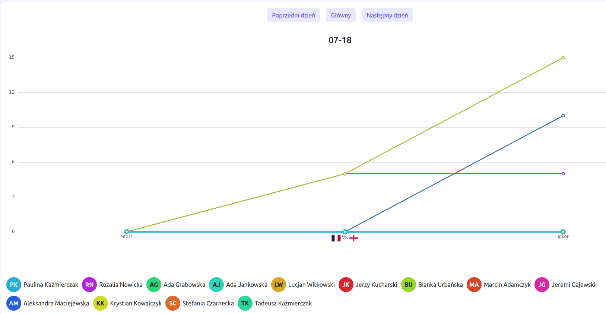
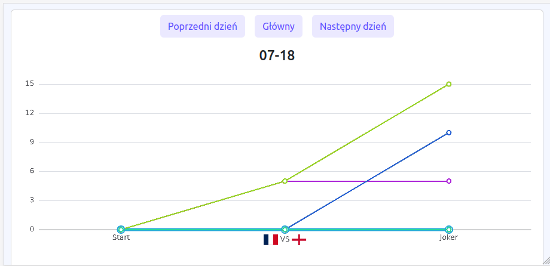
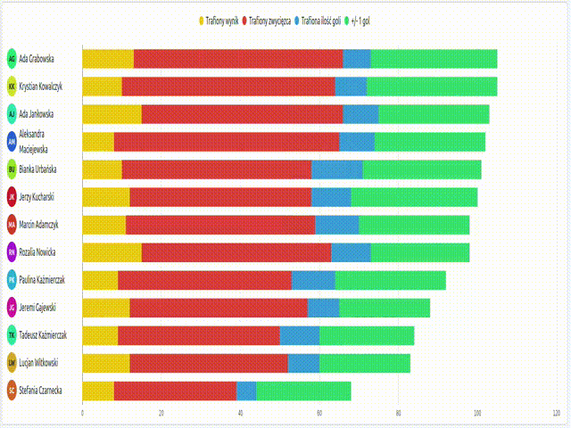
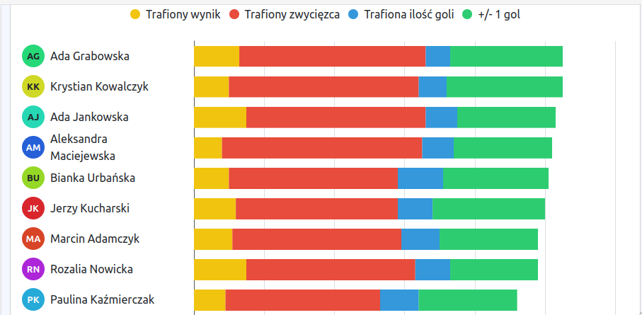

[Powrót](../FEATURES.md)

# Wykresy

## Wykres liniowy

Przedstawia narastająco ilość zdobywanych punktów przez każdego użytkownika per dzień. Kolor linii odpowiada kolorowi użytkownika z awatara.
Linia zalogowanego użytkownika jest pogrubiona.

Wykres pozwala na:
- wyłączenie z wykresu wybranych użytkowników poprzez kliknięcie jego awatara
- ograniczanie zakresu czasowego za pomocą suwaka pod wykresem, scrollem myszki
- najechanie/kliknięcie dowolnego punkt na wykresie, wyświetla tooltip z listą użytkowników i aktualną na dany moment ilością punktów
- kliknięcie w datę otwiera wykres dla tej daty.

|                           Desktop                           |                           Mobile                           |
|:-----------------------------------------------------------:|:----------------------------------------------------------:|
|  |  |

#### Wykres dla konkretnej daty

Na wykresie dla konkretnej daty, wyświetlane są punkty z podziałem na mecze z danego dnia, co pozwala zobaczyć kto ile punktów zdobył w danym dniu, a nie globalnie.
Menu nad wykresem pozwala przejść do poprzedniego lub następnego dnia oraz powrócić do głównego wykresu.

|                          Desktop                           |                          Mobile                           |
|:----------------------------------------------------------:|:---------------------------------------------------------:|
|  |  |

Jeśli jest to ostatni dzień i ktoś zdobył punkty za jokera, to dodawany jest dodatkowy punkt na wykresie.

|                           Desktop                            |                           Mobile                            |
|:------------------------------------------------------------:|:-----------------------------------------------------------:|
|  |  |

## Wykres trafień

Wykres trafień pokazuje, kto i za co dostał ile razy punkty.

Wykres pozwala na:
- wyłączenie z wykresu wybranych typów zdobytych punktów
- podświetlenie danego typu poprzez najechanie na niego
- najechanie/kliknięcie dowolnego punkt na wykresie, wyświetla tooltip z listą ile razy i za co zdobył punkty dany użytkownik

|                         Desktop                          |                           Mobile                           |
|:--------------------------------------------------------:|:----------------------------------------------------------:|
|  |     |
