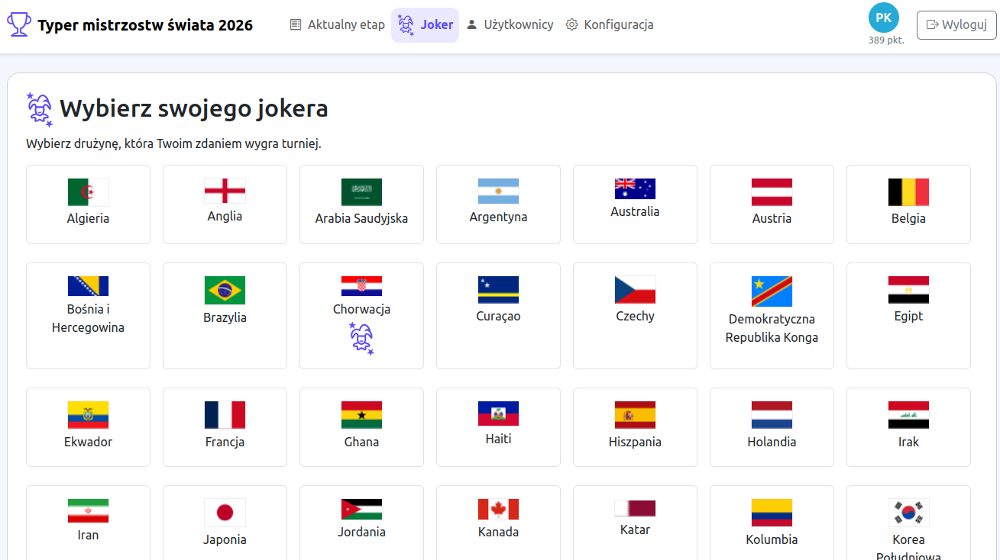
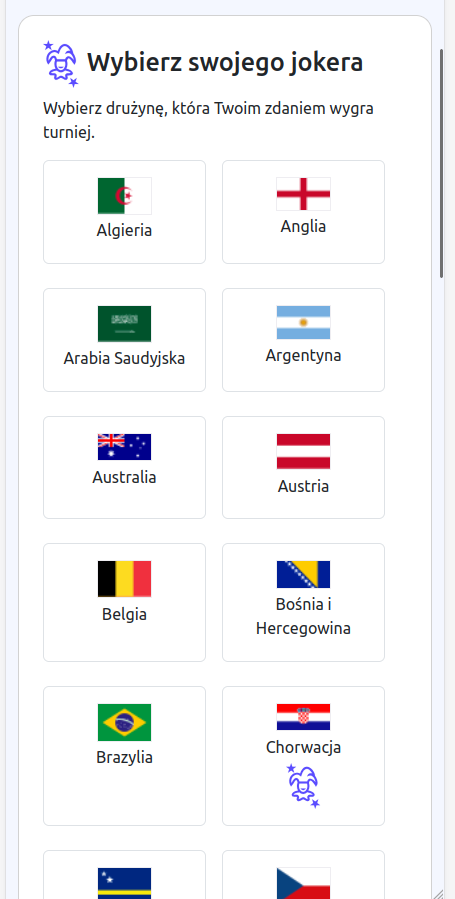
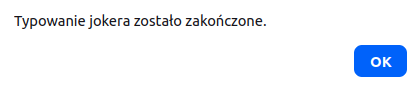
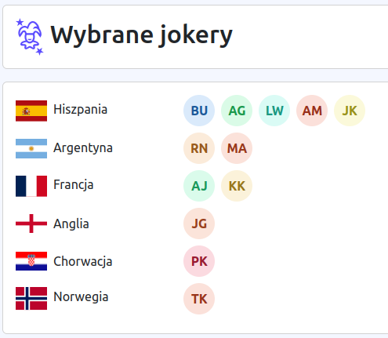
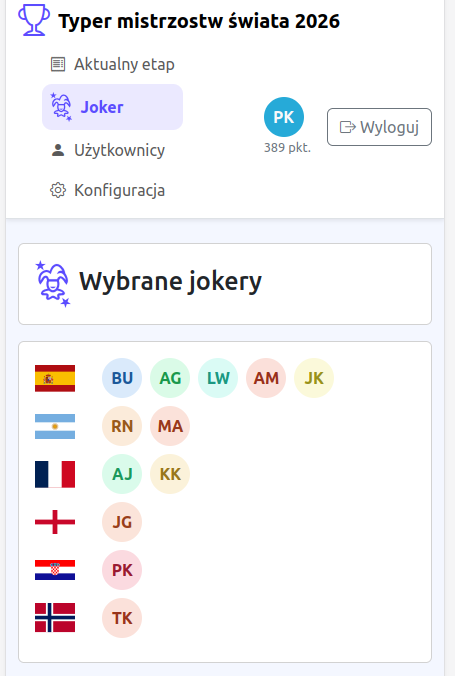
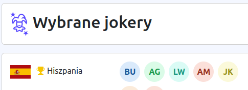

[Powrót](../FEATURES.md)

# Joker

Zanim rozpocznie się pierwszy mecz, użytkownicy mogą obstawiać zwycięzcę całych rozgrywek.
Jeśli trafią, zdobędą dodatkowe punkty.

### Obstawianie

Spośród wszystkich drużyn można wybrać dowolną z nich. Do rozpoczęcia pierwszego meczu można dowolnie zmieniać wybraną drużynę.
Przy wybranej drużynie wyświetlana jest ikonka jokera.

|                        Desktop                        |                        Mobile                        |
|:-----------------------------------------------------:|:----------------------------------------------------:|
|  |  |

Gdy czas minie, system nie pozwoli na zmianę, komunikując o tym.

### Podgląd

Gdy pierwszy mecz się rozpocznie, zamiast widoku wyboru drużyny, zostanie wyświetlony podgląd, kto jak obstawił.

|                         Desktop                          |                         Mobile                          |
|:--------------------------------------------------------:|:-------------------------------------------------------:|
|  |  |

Natomiast, gdy administrator ustawi jokera, zostanie wyświetlona dodatkowa ikonka informująca, która drużyna jest zwycięzcą.

