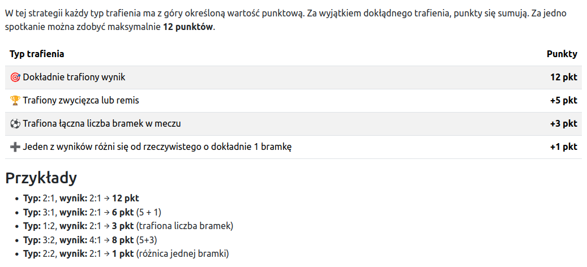
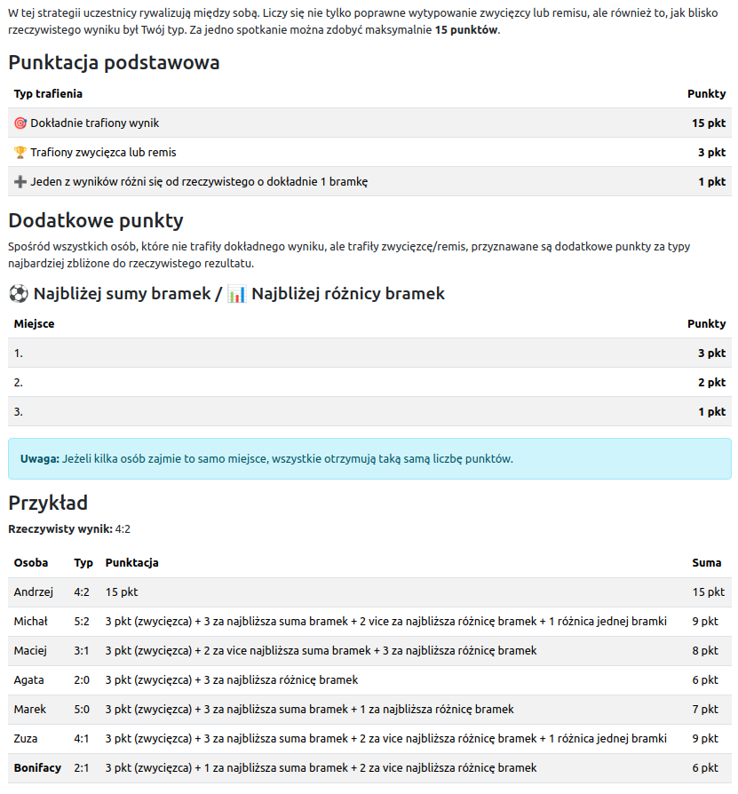

[Powrót](../FEATURES.md)

# Strategie naliczania punktów

## Klasyczna 
(domyślna)

## Proporcjonalna

## Własna punktacja

System jest przygotowany na dodawanie i usuwanie strategii punktowania. Szczegóły znajdują się w dziale [Backend](../BACKEND.md#strategy-pattern--rozszerzalny-system-naliczania-punktów).