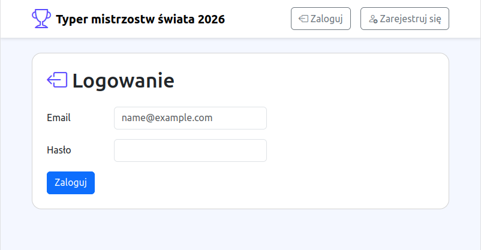
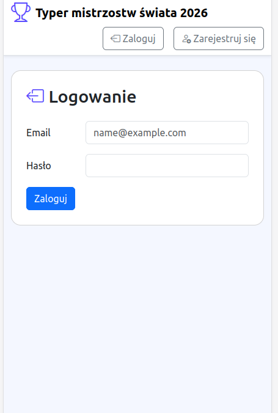
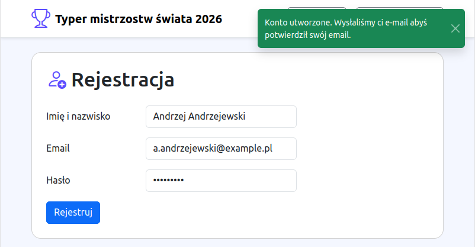
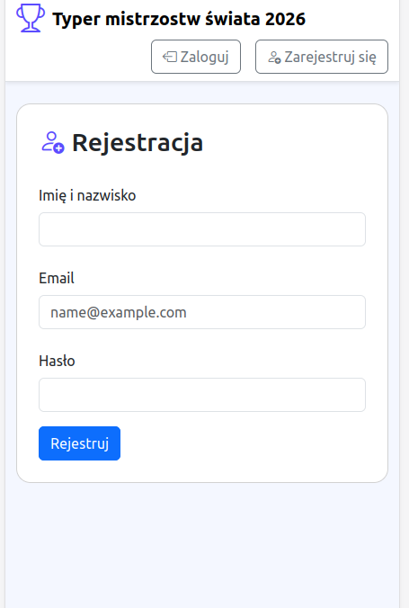

[Powrót](../FEATURES.md)

# Użytkownicy

|                        Desktop                         |                        Mobile                         |
|:------------------------------------------------------:|:-----------------------------------------------------:|
|  |  |

## Rejestracja

Użytkownicy rejestrują się podając imię i nazwisko, adres e-mail, oraz ustawiając hasło dostępowe.
Po udanej rejestracji jest proszony o potwierdzenie adresu email, poprzez kliknięcie link przesłany w mailu.

|                          Desktop                          |                          Mobile                          |
|:---------------------------------------------------------:|:--------------------------------------------------------:|
|  |  |

## Aktywacja konta

Poza potwierdzeniem adresu email użytkownik musi zostać aktywowany przez administratora w celu zabezpieczenia przez niepowołanymi rejestracjami.

## Awatar

Każdy użytkownik ma losowany kolor w oparciu o jego imię i nazwisko, które jest używane do ustawiania tła w jego awatarze.
Zależnie od jasności koloru, czcionka jego inicjałów jest biała, lub czarna.
